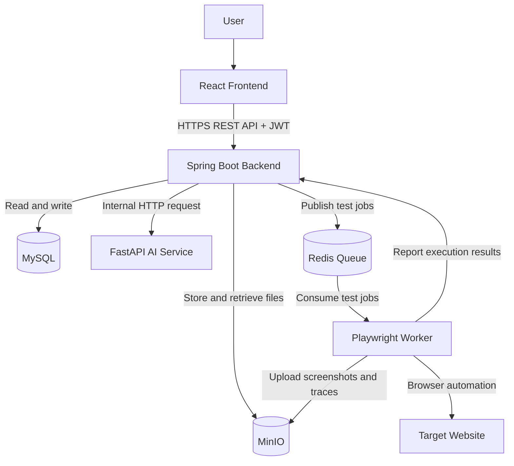
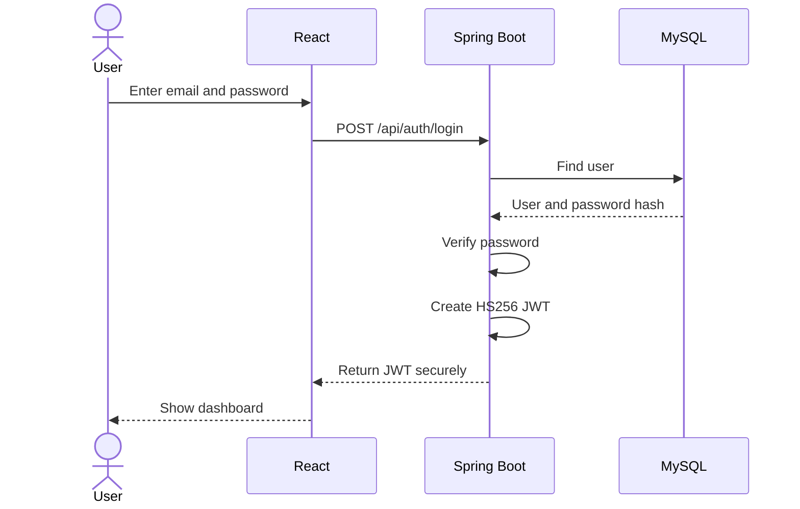
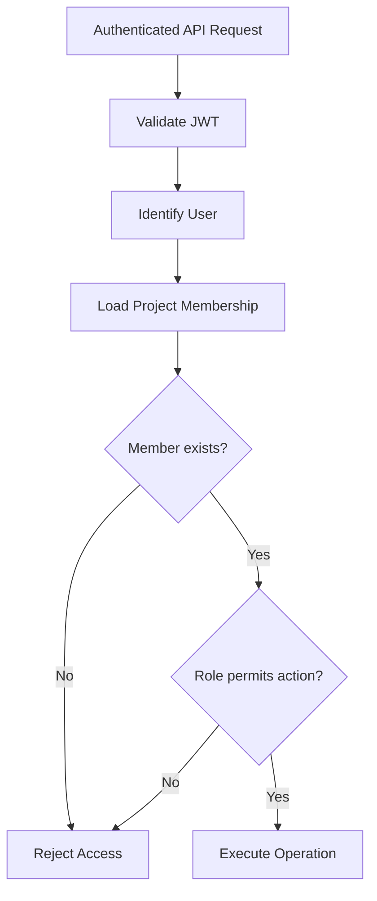
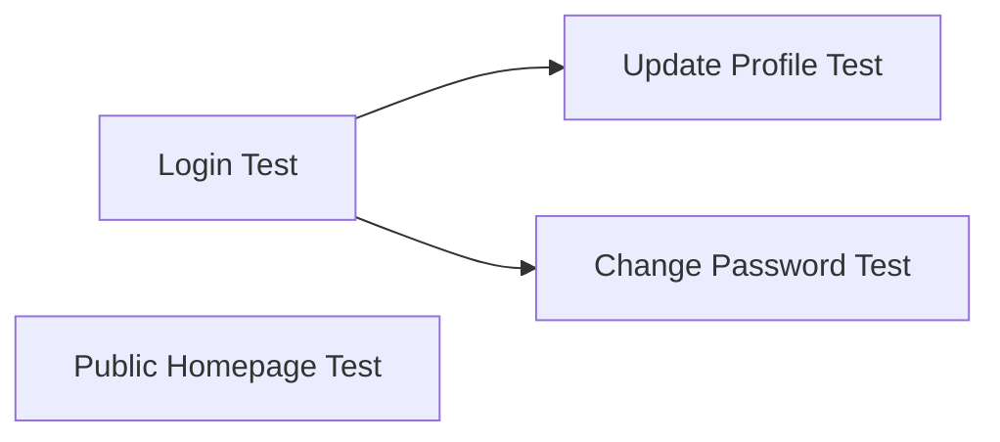
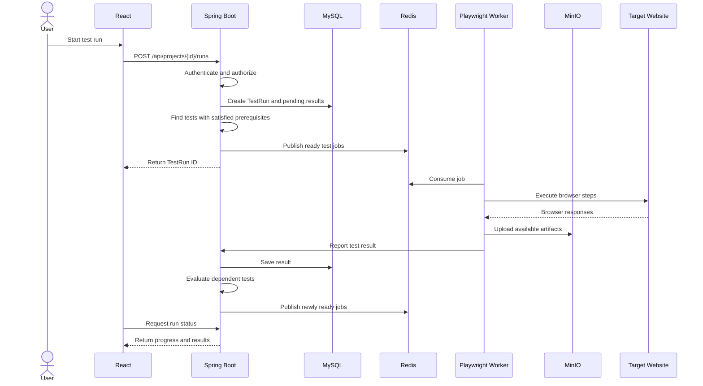
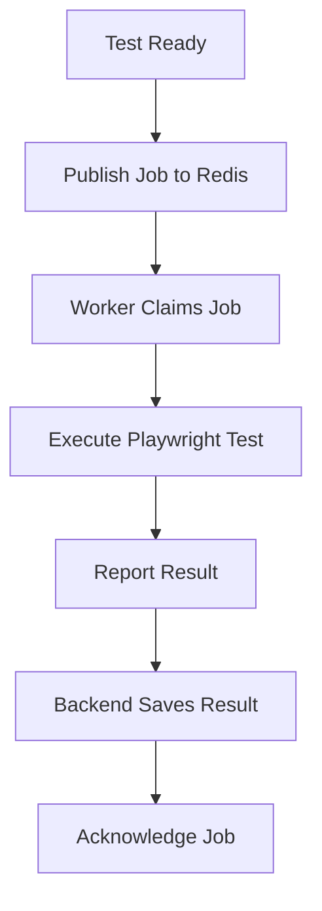
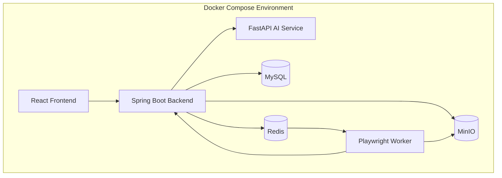

# AI Website Testing Platform — System Architecture

## 1. Overview

The AI Website Testing Platform uses a service-based architecture to generate, manage, and execute automated tests for websites and web applications.

The system separates the user interface, business logic, AI processing, and browser test execution into different services.

This separation makes the platform easier to develop, maintain, test, and scale.

The main components are:

1. React Frontend
2. Spring Boot Backend
3. FastAPI AI Service
4. Redis Job Queue
5. Playwright Worker
6. MySQL Database
7. MinIO Object Storage

Docker and Docker Compose are used to run the services, while GitHub Actions supports CI/CD.

## 2. Architecture Goals

The architecture is designed to:

- Keep frontend, backend, AI processing, and browser execution separate.
- Use one backend as the main entry point for application operations.
- Support secure user authentication and project-based authorization.
- Generate test cases using AI.
- Execute browser tests asynchronously.
- Respect dependencies between test cases.
- Support background workers and controlled concurrency.
- Store structured data and uploaded files separately.
- Recover from worker and queue failures.
- Support team collaboration.
- Provide reproducible local development and automated CI/CD.

## 3. High-Level Architecture



### Explanation

The user interacts with the React frontend.

React sends requests to Spring Boot, including a JWT access token for protected operations.

Spring Boot validates authentication, checks project permissions, and manages application data.

When the user requests AI test generation, Spring Boot communicates with FastAPI.

When the user starts a test run, Spring Boot schedules ready-to-run jobs through Redis.

Playwright workers consume those jobs, interact with the target website, and report execution results.

MySQL stores structured application data, while MinIO stores uploaded documents and test artifacts.

## 4. Frontend Architecture

### Technology

- React
- JavaScript
- Vite

### Responsibilities

The frontend provides interfaces for:

- Registration and login.
- Viewing and managing projects.
- Managing project members.
- Uploading requirements documents.
- Configuring test accounts.
- Generating AI test cases.
- Reviewing and editing test cases.
- Starting test runs.
- Viewing execution status.
- Reviewing test results and artifacts.

### Communication

The frontend communicates with the Spring Boot backend using REST APIs.

Protected requests include a valid JWT access token.

The frontend may hide or disable actions based on project permissions, but the backend remains responsible for enforcing authorization.

### Authentication Handling

The frontend must handle authentication credentials securely.

For Version 1, the preferred design is to use a secure, HttpOnly cookie for the JWT where deployment configuration allows it.

If JWTs are sent in an Authorization header instead, they should be kept in memory rather than localStorage.

Cookie-based authentication requires appropriate CSRF protection.

## 5. Backend Architecture

### Technology

- Java
- Spring Boot
- Spring Security
- JWT with HS256
- Spring Data JPA

### Responsibilities

Spring Boot is the main application backend.

It handles:

- User registration and authentication.
- JWT creation and validation.
- Project management.
- Project memberships and roles.
- Requirements document metadata.
- Test account management.
- AI generation requests.
- Test case management.
- Dependency validation.
- Test run creation and scheduling.
- Queue job coordination.
- Result processing.
- Artifact access authorization.

### Suggested Backend Structure

```text
backend/
└── src/main/java/.../
    ├── auth/
    ├── user/
    ├── project/
    ├── member/
    ├── document/
    ├── testaccount/
    ├── testcase/
    ├── testrun/
    ├── testresult/
    ├── storage/
    ├── queue/
    ├── security/
    └── common/
```

Each module can contain its own controllers, services, repositories, DTOs, and related classes.

The backend should follow a layered structure:

Controller → Service → Repository → MySQL

Controllers receive HTTP requests.

Services contain business rules.

Repositories handle database operations.

## 6. Authentication and Authorization Architecture

### 6.1 Authentication

The platform uses Spring Security with JWT access tokens signed using HS256.

One securely generated secret key is used to sign and validate JWTs.

The signing secret must be at least 256 bits and must be stored securely outside source control.

### Login Flow



### JWT Rules

- Tokens must have an expiration time.
- The initial access token lifetime is 15 minutes.
- Spring Boot must validate the signature and expiration.
- The backend must reject invalid or expired tokens.
- The backend must only accept the configured signing algorithm.
- The JWT secret must never be exposed to React, FastAPI, or Playwright workers.
- Logout removes the client's active authentication credentials.
- Without server-side revocation, an already-issued JWT remains valid until expiration.

### 6.2 Project Authorization

Project roles are stored in the `ProjectMember` entity.

Supported roles:

- OWNER
- DEVELOPER
- QA_TESTER
- VIEWER

The JWT identifies the authenticated user.

Spring Boot checks the user's membership and role for the requested project.

Project permissions are not determined by trusting a role sent by the frontend.

### Authorization Flow



## 7. AI Service Architecture

### Technology

- Python
- FastAPI

### Responsibilities

The AI service generates structured test cases from:

- Written testing instructions.
- Uploaded requirements documents.
- Project website information.

The AI service does not manage user authentication or project permissions.

Spring Boot checks authorization before requesting generation.

### Generation Flow

1. An authorized user requests test generation.
2. Spring Boot checks project permissions.
3. Spring Boot checks that testing instructions or documents exist.
4. Spring Boot obtains the required document content.
5. Spring Boot sends the relevant content to FastAPI.
6. FastAPI generates structured test cases and steps.
7. Spring Boot validates the generated output.
8. Spring Boot stores valid test cases in MySQL.
9. React displays the generated tests for review.

### AI Output

Generated test cases should include:

- Title
- Description
- Ordered steps
- Supported action types
- Optional prerequisite suggestion

AI-generated output must be validated before saving or execution.

The AI service must not be allowed to directly execute arbitrary code provided in requirements documents.

## 8. Test Case and Dependency Architecture

Each project can contain multiple test cases.

Each test case contains ordered test steps.

A test case can have zero or one prerequisite test case.

A test case may be a prerequisite for multiple other test cases.

### Dependency Example



In this example:

- The Login Test must pass before the Update Profile Test runs.
- The Login Test must pass before the Change Password Test runs.
- The Public Homepage Test is independent.

### Dependency Rules

- A test cannot depend on itself.
- Circular dependencies are rejected.
- Dependencies cannot cross project boundaries.
- Dependent tests run only after their prerequisites pass.
- If a prerequisite fails, its dependents are marked SKIPPED.
- Independent tests can run concurrently when isolation is safe.

The backend is responsible for validating and scheduling dependencies.

## 9. Test Execution Architecture

Test execution is asynchronous.

The backend does not run Playwright directly during an HTTP request.

Instead, it creates a test run, determines which test cases are ready, and publishes jobs to Redis.

### Execution Flow



### Execution Rules

- Each test case executes its steps sequentially.
- Only READY test cases can be selected for execution.
- DISABLED test cases are not executed.
- Prerequisites must pass before dependent tests run.
- Failed tests must not stop unrelated tests.
- Workers report success, failure, or inability to complete.
- Historical results preserve the executed test version or snapshot.

## 10. Redis Queue Architecture

Redis is used for reliable background job processing.

A reliable queue mechanism such as Redis Streams with consumer groups can be used.

### Responsibilities

- Hold ready-to-run test jobs.
- Deliver jobs to workers.
- Track unacknowledged jobs.
- Support recovery after worker failures.
- Support controlled retries.

### Job Lifecycle



### Reliability Rules

- Jobs must be acknowledged only after their outcomes are durably recorded.
- Unacknowledged jobs must be recoverable.
- Retry attempts must be limited.
- Processing must be idempotent to prevent duplicate results.
- The backend must prevent duplicate scheduling.
- Jobs must contain identifiers and execution information rather than sensitive credentials.

For Version 1, Redis Streams and consumer groups are a suitable implementation choice.

## 11. Playwright Worker Architecture

### Technology

- Node.js
- Playwright

### Responsibilities

Workers:

- Consume queued jobs.
- Obtain the required execution instructions.
- Launch isolated browser sessions.
- Execute ordered test steps.
- Apply browser timeouts.
- Capture errors and execution evidence.
- Upload available artifacts to MinIO.
- Report outcomes to Spring Boot.

### Supported Actions

- NAVIGATE
- CLICK
- FILL
- ASSERT_VISIBLE
- ASSERT_TEXT
- ASSERT_URL

### Worker Isolation

Workers must:

- Use separate browser contexts for independent tests.
- Apply timeouts and resource limits.
- Avoid exposing infrastructure credentials.
- Restrict access to internal and sensitive network destinations.
- Treat target websites as untrusted.

Worker concurrency is configurable.

## 12. Database Architecture

### Technology

MySQL

MySQL stores structured application data.

### Core Entities

1. User
2. Project
3. ProjectMember
4. RequirementDocument
5. TestAccount
6. TestCase
7. TestStep
8. TestRun
9. TestResult
10. TestArtifact

### Main Relationships

- A User can create multiple Projects.
- A User can belong to multiple Projects through ProjectMember.
- A Project has one or more ProjectMembers.
- A Project can have multiple RequirementDocuments.
- A Project can have multiple TestAccounts.
- A Project can contain multiple TestCases.
- A TestCase contains ordered TestSteps.
- A TestCase can depend on another TestCase in the same project.
- A Project can have multiple TestRuns.
- A TestRun produces TestResults.
- A TestResult belongs to a TestCase.
- A TestResult can have multiple TestArtifacts.

### Database Constraints

- User email must be unique.
- Project membership must be unique for each user and project.
- Test step sequence numbers must be unique within a test case.
- Test prerequisites are optional.
- The backend must reject circular dependencies.
- Every project must retain an OWNER.
- Enum values must be validated.

Detailed database columns and relationships are documented in `docs/database.md`.

## 13. MinIO Storage Architecture

MinIO stores files rather than relational data.

### Stored Files

**Requirements documents**
- PDF files
- TXT files
- Markdown files

**Test artifacts**
- Screenshots
- Browser traces
- Execution logs

MySQL stores file metadata and storage keys.

### Storage Flow

1. An authorized user uploads a document.
2. Spring Boot validates the upload.
3. The file is stored in MinIO.
4. Metadata is saved in MySQL.
5. The file can be retrieved only through an authorized operation.

Workers can upload execution artifacts using restricted storage permissions or short-lived upload URLs.

MinIO buckets must remain private by default.

## 14. Service Communication

| From | To | Communication | Purpose |
|---|---|---|---|
| React | Spring Boot | HTTPS REST | User operations |
| Spring Boot | MySQL | Database connection | Structured data |
| Spring Boot | FastAPI | Internal HTTP | AI test generation |
| Spring Boot | Redis | Redis protocol | Publish test jobs |
| Playwright Worker | Redis | Redis protocol | Consume jobs |
| Playwright Worker | Spring Boot | Internal HTTP | Report results |
| Spring Boot | MinIO | S3-compatible API | Store and retrieve files |
| Playwright Worker | MinIO | S3-compatible API | Upload artifacts |
| Playwright Worker | Target Website | HTTP/HTTPS | Browser testing |

### Communication Security

- React communicates with Spring Boot using authenticated requests.
- Spring Boot verifies user permissions.
- Internal services use protected network connections and service-level credentials where required.
- User JWTs are not shared with background workers.
- Database, Redis, and MinIO must not be publicly accessible without authorization.

## 15. Error Handling and Reliability

The system must handle failures without losing important execution information.

### AI Generation Failures

- Return an understandable error.
- Avoid saving invalid generated test cases.
- Allow the user to retry generation.

### Worker Failures

- Recover unacknowledged jobs.
- Retry eligible jobs according to policy.
- Prevent duplicate results.
- Mark unrecoverable executions appropriately.

### Test Failures

- Record the failure reason.
- Capture available evidence.
- Skip dependent tests when prerequisites fail.
- Continue unrelated tests.

### Storage Failures

- Record upload or retrieval errors.
- Avoid reporting artifacts as available when storage failed.
- Allow recovery or cleanup of incomplete uploads.

## 16. Docker Architecture

Docker and Docker Compose provide a reproducible local environment.

### Main Containers

- Frontend
- Backend
- AI Service
- Playwright Worker
- MySQL
- Redis
- MinIO

### Example Local Deployment



### Configuration

- Environment variables provide application configuration.
- Secrets must not be committed to GitHub.
- MySQL and MinIO use persistent volumes.
- Redis persistence and recovery configuration must match the selected queue design.
- Internal services should communicate through the Docker network.

## 17. CI/CD Architecture

### Technology

GitHub Actions

### Continuous Integration

On pushes and pull requests, GitHub Actions should:

1. Check out the repository.
2. Install required dependencies.
3. Build the frontend.
4. Build and test the Spring Boot backend.
5. Test the FastAPI AI service.
6. Test the Playwright worker.
7. Validate relevant Docker configuration.
8. Report failures.

### Continuous Deployment

The deployment workflow should:

1. Run only after required checks pass.
2. Build deployable application images.
3. Publish images to a configured registry when needed.
4. Deploy to the selected environment.
5. Use securely stored deployment credentials.

The deployment target will be chosen during implementation.

## 18. Architectural Decisions

### AD-01: React for the Frontend

React provides a component-based interface for project management, test editing, and reports.

### AD-02: Spring Boot as the Main Backend

Spring Boot centralizes business logic, authentication, authorization, and execution coordination.

### AD-03: JWT with HS256

JWT access tokens use one securely generated signing secret.

This is appropriate because Spring Boot is the only service responsible for verifying user authentication tokens.

### AD-04: Project-Based Roles

Roles belong to ProjectMember rather than User because the same user may have different permissions in different projects.

### AD-05: FastAPI for AI Processing

The AI service is separated from Spring Boot so AI-related functionality can evolve independently.

### AD-06: Redis for Background Execution

Redis separates long-running browser tests from HTTP requests and supports reliable job processing.

### AD-07: Playwright Workers

Browser execution is handled by dedicated workers rather than the backend.

### AD-08: MySQL and MinIO

MySQL stores structured records, while MinIO stores uploaded files and execution artifacts.

### AD-09: Docker and GitHub Actions

Docker provides consistent environments, while GitHub Actions automates testing and deployment workflows.

## 19. Version 1 Architecture Scope

Version 1 includes all seven main runtime components:

- React Frontend
- Spring Boot Backend
- FastAPI AI Service
- Redis Job Queue
- Playwright Worker
- MySQL
- MinIO

It also includes:

- Spring Security authentication.
- HS256 JWT access tokens.
- Project membership and roles.
- AI test generation.
- Dependency-aware execution.
- Reliable queue processing.
- Controlled worker concurrency.
- Secure document and artifact storage.
- Docker Compose.
- GitHub Actions CI/CD.

The architecture focuses on browser testing for websites and web applications, not native mobile testing or dedicated API testing.

## 20. Summary

The AI Website Testing Platform separates user interaction, application logic, AI generation, and browser execution into dedicated services.

React provides the interface.

Spring Boot manages authentication, authorization, projects, tests, and execution scheduling.

FastAPI generates test cases.

Redis coordinates background jobs.

Playwright workers execute tests.

MySQL stores structured data.

MinIO stores documents and artifacts.

Docker and GitHub Actions support development, testing, and deployment.

This architecture provides a practical foundation for Version 1 while allowing the platform to grow in later versions.